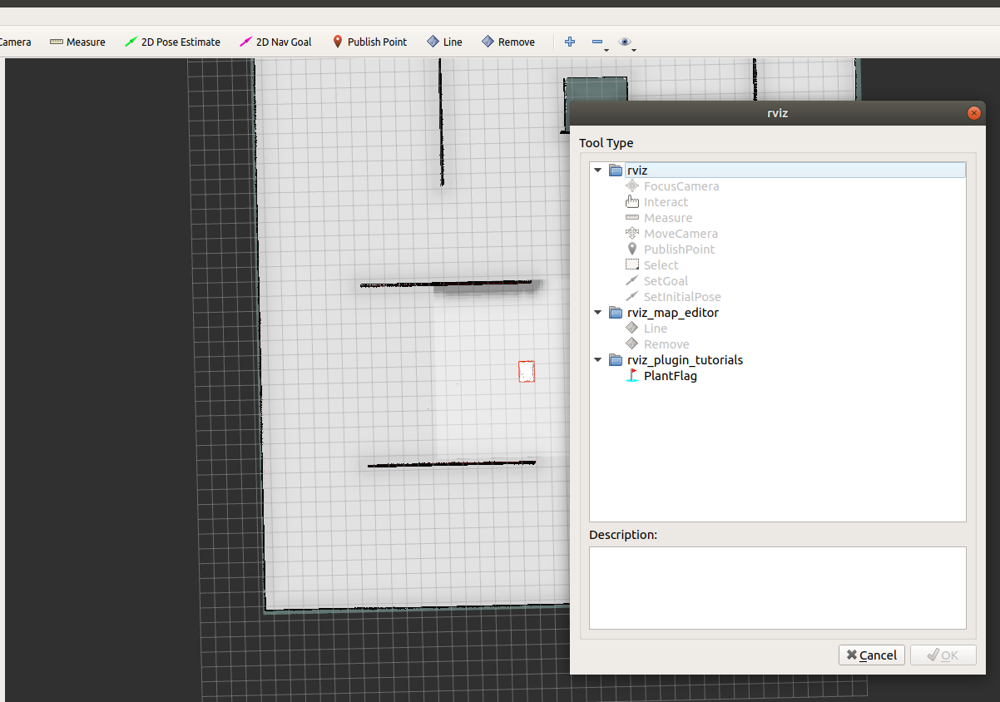
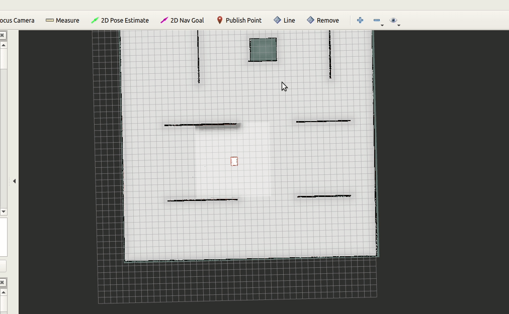
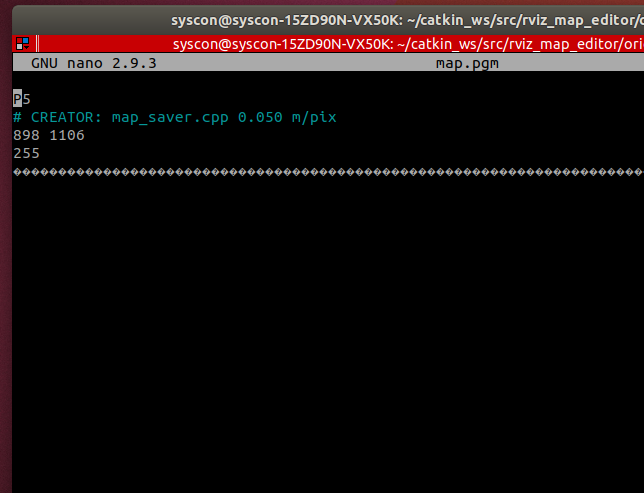

## Manual

작성자 : 우성호 , 작성일지: 2021/11/25

#### 목적 :  rviz 를 이용해서 스캔 값을 기준으로 간단히 맵 (.png)를  수정한다

---

Installation :  Rviz_map_editor Repo를 사용자 컴퓨터에 make를 하면 자동으로 Rviz tool 까지 깔린다. (편안..)

----

#### 사용전세팅:

1. 바꾸고자하는 map.pgm 을 로봇에서 가져와 rviz_map_editor/original_map안에 넣는다.

2. launch 폴더안에  rviz_edit.launch를 실행하기전 로봇RID 세팅 및 파일 로드 ,세이브 경로를 세팅한다. 

----

#### Rviz 세팅 및 Tool 기능 

1. 상단창에 + 모양을 클릭하고 rviz_map_editor 폴더안에 Line tool 과 Remove tool을 클릭해 위치 시킨다

   

       
 사진 첨부

        -->
   
            

2. remove tool은 지우는용도로써 단축기 ' r ' 을 이용하면 생성되고 클릭되면 지름 2m 인 원모양이 생성되어 지우고 싶은곳에 내려놓으면된다. 

3. line tool은 직선을 그리는 용도로 한번 클릭되면 measure기능처럼 쭉 늘어나 원하는 곳을 다시 클릭하면 직선이 완성된다. 이때 다음 직선을 그리기위해 상단 바를 클릭할 필요없이 연속 그리기가 가능하다. 

   

       
영상 첨부

       
   

   

----

#### 사용과정

1. rviz_edit.launch를 실행하면 시작한다는 문구가 뜨며 그떄부터 Rviz 로부터 토픽을 받아온다.

2. ** rviz에서 부터 클릭된 순간 낙장불입이되며 다시 되돌릴 수 없다. 다시 하기위해선 rviz를 재시작 , rviz_edit 재시작이 필요하다

3. 모든곳을 수정했으면 riviz_map_editor노드를 종료(ctrl + c) 를 하게 되고 자동저장이 된다.

4. ** edit_map.png를 nano를 열어 한줄을 추가해줘야한다.  original map에서 보여진 '' **# CREATOR: map_saver.cpp 0.050 m/pix ''** 를 삽입하여 저장해준다 . ( map server를 거치지않는 png  파일을 수정하므로 # 이 붙지않는다. Software 2팀이 맵을 읽어올때 (#) 필요하단 사실..!)

   

       
영상 첨부

       
   

   

